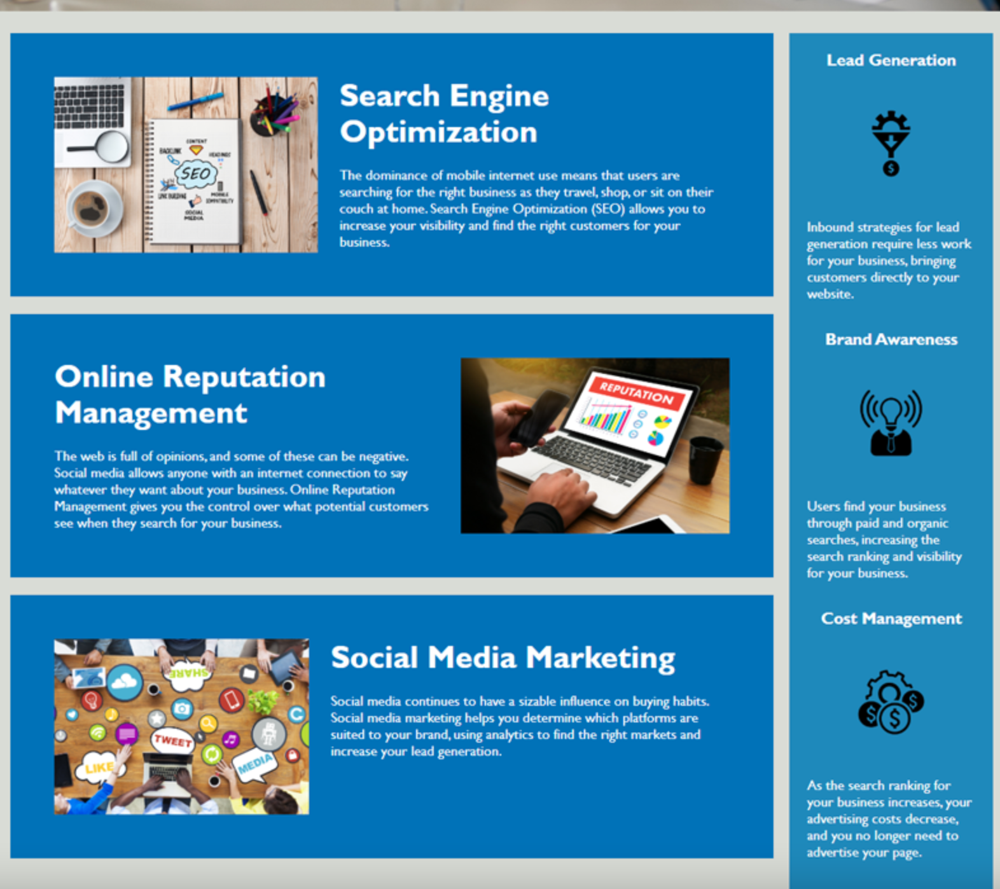
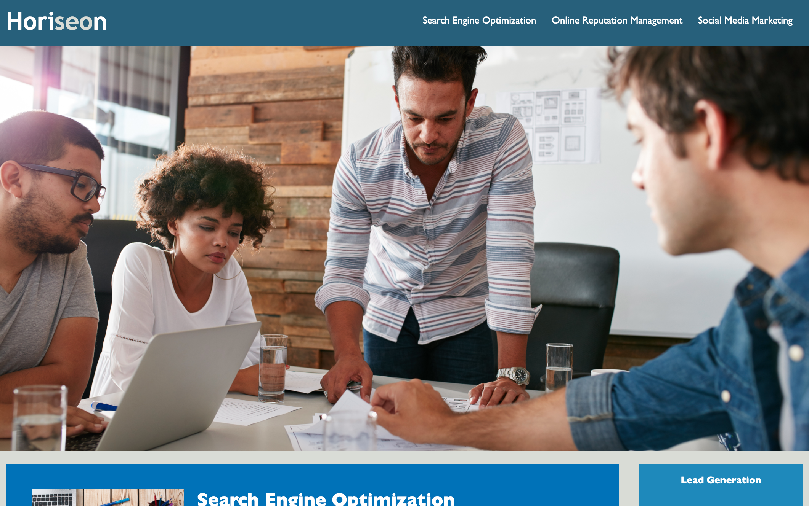
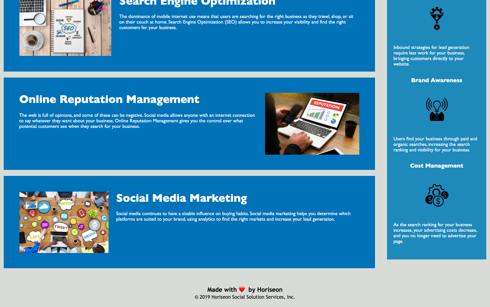

# Horiseon Marketing - Semantic HTML

## Description

A sample responsive website for Marketing/Social Media Services.
Bugs fixed: unresponsive links, right usage of semantic HTML elements, putting in place a good folder structure, getting CSS refractor on point by identifying all code duplication, getting CSS file properly commented.

## Deployed URL

You can view the GitHub pages deployed application [here](https://andradag.github.io/Semantic-html/).

## Technologies and Frameworks Used

- HTML
- CSS

## Screenshots

### Before

### After

